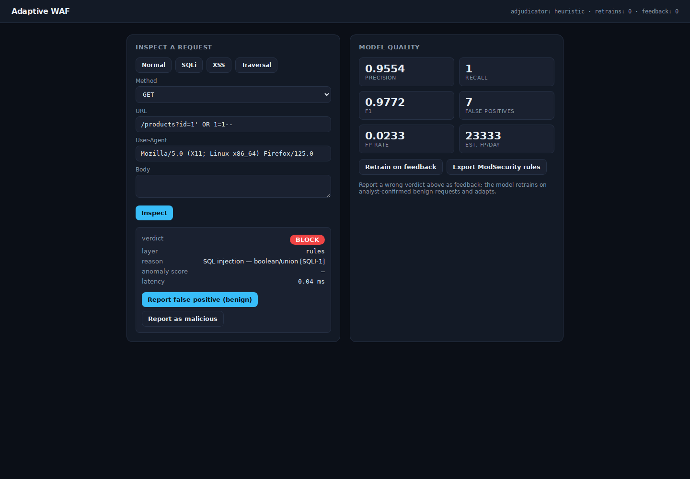

# Adaptive WAF

**A Web Application Firewall whose detection improves from its own mistakes.** Three
layers — signature rules, an unsupervised anomaly model, and an LLM adjudicator —
decide `ALLOW` / `CHALLENGE` / `BLOCK` per request, and a feedback loop retrains
the model on analyst-corrected false positives so it adapts to *your* traffic.

[](https://github.com/Vincent-P-essy/adaptive-waf/actions/workflows/ci.yml)


---

## Dashboard Preview



Local execution using the bundled bootstrap corpus and the SQL injection example provided by the interface.

## What makes it "adaptive"

Most ML-security projects make a prediction and stop. This one **closes the
loop**: every false positive an analyst reports becomes a training example, the
anomaly model retrains on the corrected corpus, and the next identical request is
allowed. Continuous learning from operator feedback is the pattern most valued in
production — and the thing this project is built to demonstrate.

```
                 ┌── layer 1: signature rules (CRS-style)  ── fast, high-precision
request ──feats──┤── layer 2: Isolation Forest (anomaly)   ── unsupervised, from scratch
                 └── layer 3: LLM adjudicator (ambiguous)   ── Claude, heuristic fallback
                         │
                    ALLOW / CHALLENGE / BLOCK
                         │
      analyst marks a false positive ──▶ feedback store ──▶ retrain layer 2
                         ▲                                        │
                         └──────────── model adapts ◀────────────┘
```

## Highlights

| Capability | Detail |
|---|---|
| **From-scratch Isolation Forest** | The anomaly model is implemented from first principles (random isolation trees, path-length anomaly score with the `c(n)` normalisation) — no scikit-learn. |
| **11-feature request pipeline** | Payload entropy, path depth, parameter count, special-char ratio, keyword hits, user-agent anomaly, method, body length, and more, extracted from parsed requests. |
| **3-layer decision engine** | Rules catch known attacks instantly; the ML layer scores the rest; only a narrow ambiguous band escalates to the LLM — keeping latency low. |
| **Feedback → retrain loop** | Analyst-labelled false positives/negatives update the corpus; `retrain()` re-fits the forest so corrections stick. |
| **ModSecurity export** | Emits `SecRule` directives from the signature layer for drop-in use in an existing ModSecurity/CRS deployment. |
| **Real metrics** | Precision, recall, F1, false-positive rate and an estimated FP/day against a labelled evaluation set. |
| **CSIC 2010 + synthetic bootstrap** | Loads the CSIC 2010 dataset if present; otherwise generates a realistic normal/anomalous corpus so everything runs offline. |
| **FastAPI service** | `/inspect`, `/feedback`, `/retrain`, `/metrics`, `/rules/export`. |

## Quick start

```bash
git clone https://github.com/Vincent-P-essy/adaptive-waf
cd adaptive-waf
python -m venv .venv && source .venv/bin/activate
pip install -r requirements.txt

python -m awaf.train        # bootstrap: build corpus, fit the forest, print eval metrics
uvicorn awaf.api:app        # http://localhost:8000
```

Inspect a request:

```bash
curl -s localhost:8000/inspect -X POST -H 'content-type: application/json' -d '{
  "method": "GET",
  "url": "/products?id=1%27%20OR%201=1--",
  "headers": {"User-Agent": "sqlmap/1.7"},
  "body": ""
}' | jq
# -> { "decision": "BLOCK", "layer": "rules", "reason": "SQL injection signature", ... }
```

Report a false positive and watch it stick:

```bash
curl -s localhost:8000/feedback -X POST -H 'content-type: application/json' \
  -d '{"request": {...}, "label": "benign", "was": "BLOCK"}'
curl -s localhost:8000/retrain -X POST     # model re-fits on the corrected corpus
```

## The feedback loop, demonstrated

`python -m awaf.demo_feedback` runs the loop end to end: it finds a benign
request the model wrongly flags, reports it as a false positive, retrains, and
shows the same request is now allowed — with precision/recall before and after.

## Architecture

```
awaf/ingest      nginx JSON log parser + CSIC/synthetic dataset loader
awaf/features    request → 11-dim feature vector (+ StandardScaler)
awaf/ml          from-scratch Isolation Forest + scaler
awaf/rules       signature layer (SQLi, XSS, traversal, SSRF, scanner UAs)
awaf/llm         LLM adjudicator for the ambiguous band (Claude + heuristic)
awaf/engine      3-layer decision pipeline → ALLOW/CHALLENGE/BLOCK
awaf/feedback    feedback store + retraining
awaf/modsec      ModSecurity SecRule export
awaf/metrics     precision / recall / F1 / FP-rate / FP-per-day
awaf/api         FastAPI service
```

See [`docs/ARCHITECTURE.md`](docs/ARCHITECTURE.md) for the Isolation Forest maths,
the three-layer latency budget, and the feedback-loop design.

## Configuration

| Variable | Default | Purpose |
|---|---|---|
| `ANTHROPIC_API_KEY` | *(unset)* | Enables the Claude adjudicator; heuristic fallback otherwise |
| `AWAF_MODEL` | `claude-opus-4-8` | Model id for the adjudicator |
| `AWAF_BLOCK_THRESHOLD` | `0.62` | Anomaly score at/above which the ML layer blocks |
| `AWAF_AMBIGUOUS_BAND` | `0.08` | Width of the band below the threshold escalated to the LLM |
| `CSIC_PATH` | *(unset)* | Path to a CSIC 2010 CSV; synthetic corpus used when unset |

## Testing

```bash
pytest              # unit + ML + engine + feedback + API
ruff check awaf tests
```

## License

MIT © Vincent Plessy
